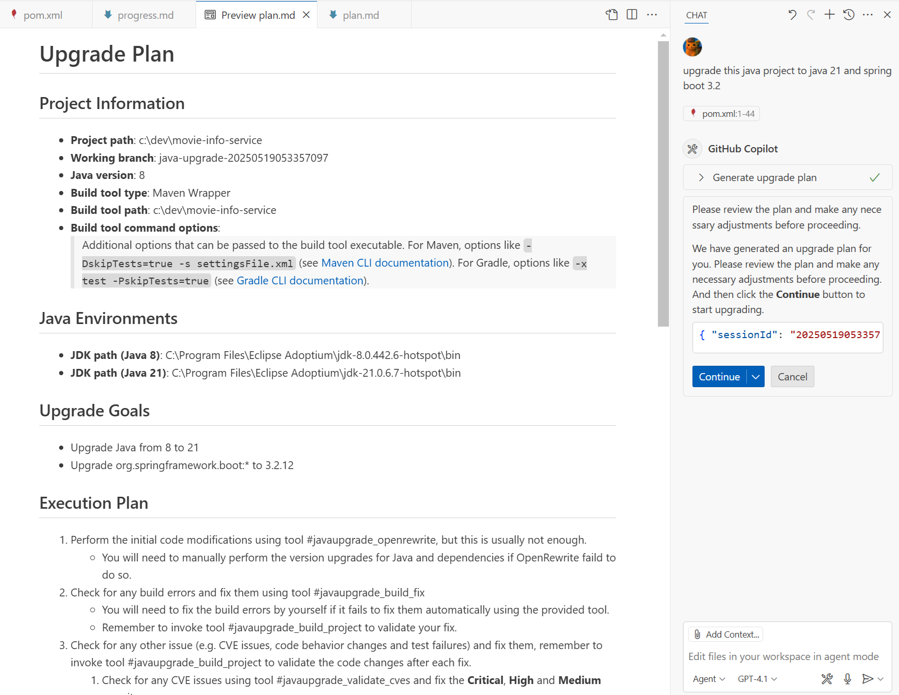
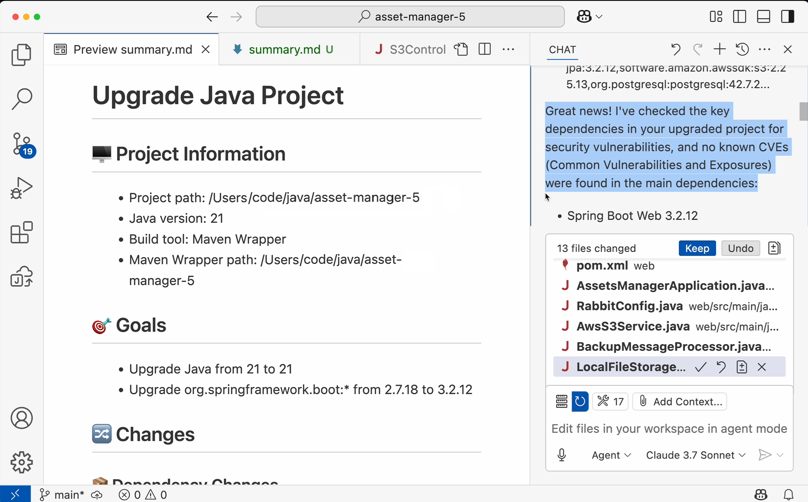

# What is GitHub Copilot app modernization for Java?

GitHub Copilot offers app modernization capabilities that allow developers to quickly assess, upgrade and modernize their Java and .NET applications with autonomous AI agents.

## Assessment of modernization issues

Modernization starts with understanding your code. App modernization for Java evaluates the readiness of your application for version upgrade and Azure migration scenarios, with an interactive experience on VS Code, powered by [AppCAT for Java](https://aka.ms/appcat-install).

## Version and framework upgrade
Seamlessly upgrade Java versions and associated frameworks to improve performance and security and reduces tech debt.

## Solution recommendations

App modernization for Java recommends target Azure services for the resource dependencies of your application, for each category of assessed issues.

## Code remediation for common issues

To accelerate code changes for [common modernization issues](https://aka.ms/migrate-github-copilot-app-modernization-for-java-predefined-formula), you may apply predefined tasks (code change patterns) that represent best practices from experts.

## Repeat changes from commits

To imitate past changes on other applications, you may pick some git commits and/or the working tree diff, save them as a custom task, then apply it just like a predefined task.

## Automatic fix for compilation errors

After applying tasks, app modernization for Java will automatically find and fix compilation errors introduced by the code changes.

## Post-Upgrade CVE Validation
After the upgrade process is completed, the tool scans for CVE (Common Vulnerabilities and Exposures) issues and code inconsistencies. When such issues are detected, it automatically applies fixes within VS Code Agent Mode, allowing the user to review the changes. This enhances the application's security posture and ensures compliance with organizational guidelines.

## Unit Test generation and validation 
At the end of the upgrade or migration process, app modernization for Java can generate unit test cases separately to increase test coverage, and ensure everything still works by validating unit tests.

# How do I get started?

To use app modernization for Java, you need:
* [A GitHub account with GitHub Copilot enabled](https://github.com/features/copilot) - Pro, Pro+, Business or Enterprise plan is needed
* [The GitHub Copilot extension](https://code.visualstudio.com/docs/copilot/overview) - the latest version is recommended

# Feedback

We value your feedback — share [your thoughts here](https://aka.ms/AM4JFeedback) to help us continue improving the product.

# License

This extension is licensed under [GitHub Copilot Product Specifc Terms](https://github.com/customer-terms/github-copilot-product-specific-terms).

# Trademarks

This project may contain trademarks or logos for projects, products, or services. Authorized use of Microsoft trademarks or logos is subject to and must follow [Microsoft's Trademark & Brand Guidelines](https://www.microsoft.com/legal/intellectualproperty/trademarks/usage/general). Use of Microsoft trademarks or logos in modified versions of this project must not cause confusion or imply Microsoft sponsorship. Any use of third-party trademarks or logos are subject to those third-party's policies.

# Privacy statement

App modernization for Java uses GitHub Copilot just like how you modify code with GitHub Copilot, which does not retain code snippets beyond the immediate session. We do not collect, transmit or store your custom tasks either. Please review the [Microsoft Privacy Statement](https://go.microsoft.com/fwlink/?LinkId=521839) if necessary.

Telemetry metrics are collected and analyzed to track feature usage and effectiveness. Learn more about [telemetry settings in VS Code](https://code.visualstudio.com/docs/configure/telemetry).

# Transparency note

App modernization for Java uses GitHub Copilot to make code changes, and AI sometimes makes mistakes. Please carefully review and test the code changes made by the tool, before using them on your production environment.

# More information

Here is some documentation that may be helpful.
* [Common modernization issues with predefined tasks](https://aka.ms/migrate-github-copilot-app-modernization-for-java-predefined-formula)
* [Java upgrade overview](https://aka.ms/java-upgrade-docs)
* [Quickstart on using managed identity instead of passwords](https://aka.ms/migrate-github-copilot-app-modernization-for-java-quickstart-assess-migrate)
* [Quickstart on creating and applying your own task](https://aka.ms/migrate-github-copilot-app-modernization-for-java-quickstart-create-and-apply-your-own-formula)
* [Frequently Asked Questions](https://aka.ms/migrate-github-copilot-app-modernization-for-java-faq)
